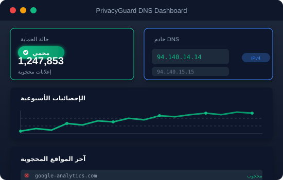

# PrivacyGuard DNS - خدمة حظر الإعلانات

<div align="center">


**خدمة DNS آمنة وسريعة وحرة لحظر الإعلانات وحماية الخصوصية**

[](https://github.com/username/privacyguard-dns/actions/workflows/ci.yml)
[](https://codecov.io/gh/username/privacyguard-dns)
[](https://opensource.org/licenses/MIT)
[](https://hub.docker.com/r/username/privacyguard-dns)

[](https://developer.mozilla.org/en-US/docs/Web/HTML)
[](https://developer.mozilla.org/en-US/docs/Web/CSS)
[](https://developer.mozilla.org/en-US/docs/Web/JavaScript)

🌐 [التوثيق بالعربية](README.ar.md) | 📄 [التوثيق بالإنجليزية](README.md)

</div>

---

## جدول المحتويات

- [عن المشروع](#عن-المشروع)
- [المميزات](#المميزات)
- [البدء السريع](#البدء-السريع)
- [عناوين خوادم DNS](#عناوين-خوادم-dns)
- [التوثيق](#التوثيق)
- [هيكل المشروع](#هيكل-المشروع)
- [التقنيات المستخدمة](#التقنيات-المستخدمة)
- [دعم المتصفحات](#دعم-المتصفحات)
- [المساهمة](#المساهمة)
- [الرخصة](#الرخصة)
- [التواصل](#التواصل)

---

## عن المشروع

PrivacyGuard DNS هي خدمة DNS مجانية وسريعة وآمنة مصممة لحظر الإعلانات والمتتبعات والمواقع الخبيثة عبر جميع أجهزتك. تعمل خدمتنا على مستوى الشبكة، مما يوفر الحماية دون الحاجة لتثبيت أي برامج على أجهزتك.

### لماذا PrivacyGuard DNS؟

- **🔒 الخصوصية أولاً**: لا نسجل نشاط تصفحك أو بياناتك الشخصية
- **🚀 سرعة فائقة**: خوادم مُحسّنة بتغطية عالمية تضمن أقل زمن استجابة
- **🛡️ حماية شاملة**: حظر الإعلانات والمتتبعات والبرمجيات الخبيثة والمحتوى غير اللائق
- **🌐 متعددة المنصات**: تعمل على Windows وmacOS وLinux وAndroid وiOS وأجهزة التوجيه
- **💰 مجانية تماماً**: لا توجد رسوم مخفية أو مستويات مدفوعة، فقط حماية مجانية

---

## معاينة المميزات


---

## المميزات

### المميزات الأساسية

| الميزة | الوصف |
|--------|-------|
| **حظر الإعلانات** | حظر جميع أنواع الإعلانات بما في ذلك البانرات والنوافذ المنبثقة وإعلانات الفيديو |
| **مكافحة التتبع** | منع المتتبعات من مراقبة نشاطك على الإنترنت |
| **حماية من البرمجيات الخبيثة** | حظر الوصول إلى المواقع الخبيثة ومواقع التصيد المعروفة |
| **حماية العائلة** | تصفية المحتوى غير اللائق لتجربة تصفح آمنة |
| **بدون تسجيل** | لا نسجل أو نشارك بيانات تصفحك أبداً |
| **تخزين مؤقت ذكي** | صفحات أسرع مع تخزين مؤقت ذكي لـ DNS |

### دعم المنصات

- ✅ Windows 10/11
- ✅ macOS (جميع الإصدارات)
- ✅ Linux (جميع التوزيعات الرئيسية)
- ✅ Android (6.0 وما فوق)
- ✅ iOS/iPadOS (12 وما فوق)
- ✅ أجهزة التوجيه (جميع العلامات التجارية)
- ✅ أجهزة التلفزيون الذكية ووحدات الألعاب

---

## البدء السريع

### 1. الحصول على عناوين DNS

استخدم عناوين خوادم DNS الموصى بها:

```
IPv4 الأساسي:     94.140.14.14
IPv4 البديل:      94.140.15.15
IPv6 الأساسي:     2a10:50c0::ad1:ff
```

### 2. تكوين جهازك

اختر جهازك من [دليل التكوين](docs/CONFIGURATION.ar.md) للحصول على تعليمات خطوة بخطوة.

### 3. التحقق من الإعداد

قم بزيارة [صفحة اختبار DNS](https://dnscheck.tools) للتحقق من صحة تكوينك.

---

## عناوين خوادم DNS

### الخوادم القياسية (موصى بها)

| البروتوكول | العنوان | الحالة |
|------------|---------|--------|
| IPv4 | `94.140.14.14` | ✅ نشط |
| IPv4 | `94.140.15.15` | ✅ نشط |
| IPv6 | `2a10:50c0::ad1:ff` | ✅ نشط |

### التحقق

للتحقق من تكوين DNS بشكل صحيح، قم بتنفيذ:

```bash
# على Windows
nslookup google.com

# على macOS/Linux
dig google.com

# يجب أن يُرجع عناوين خوادمنا
```

---

## التوثيق

يتوفر توثيق شامل في مجلد [docs](docs/):

| المستند | الوصف |
|---------|-------|
| [دليل التكوين](docs/CONFIGURATION.ar.md) | أدلة الإعداد لجميع المنصات |
| [الأسئلة الشائعة](docs/FAQ.ar.md) | الأسئلة المتكررة والإجابات |
| [حل المشكلات](docs/TROUBLESHOOTING.ar.md) | المشاكل الشائعة والحلول |
| [توثيق API](docs/API.ar.md) | مرجع واجهة البرمجة للمطورين |
| [دليل Docker](docs/DOCKER.ar.md) | نشر وإدارة الحاويات |
| [دليل المساهمة](CONTRIBUTING.ar.md) | إرشادات للمساهمين |
| [سياسة الأمان](docs/SECURITY.ar.md) | ممارسات الأمان والإبلاغ عن الثغرات |

---

## معاينة لوحة التحكم



---

## هيكل المشروع

```
PrivacyGuard-DNS/
├── 📂 .github/              # تكوين GitHub
│   └── 📂 workflows/        # سير عمل CI/CD
├── 📂 dist/                 # ملفات البناء للتوزيع
├── 📂 docs/                 # التوثيق
│   ├── CONFIGURATION.ar.md  # أدلة الإعداد
│   ├── FAQ.ar.md            # قسم الأسئلة الشائعة
│   ├── TROUBLESHOOTING.ar.md# حل المشكلات
│   ├── API.ar.md            # توثيق API
│   ├── SECURITY.ar.md       # سياسة الأمان
│   ├── DOCKER.ar.md         # دليل النشر بـ Docker
│   └── images/              # صور التوثيق
├── 📂 src/                  # ملفات المصدر
│   ├── 📂 css/              # ملفات الأنماط
│   │   └── main.css         # الأنماط الرئيسية
│   └── 📂 js/               # وحدات JavaScript
│       ├── main.js          # منطق التطبيق الرئيسي
│       ├── i18n.js          # دعم اللغات المتعددة
│       └── utils.js         # الدوال المساعدة
├── 📂 tests/                # ملفات الاختبار
│   └── app.test.js          # اختبارات التطبيق
├── 📂 tools/                # أدوات البناء والمساعدة
├── .dockerignore            # قواعد تجاهل Docker
├── .eslintrc.json           # إعدادات ESLint
├── .gitignore               # قواعد تجاهل Git
├── .prettierrc              # إعدادات Prettier
├── .babel.config.json       # إعدادات Babel
├── babel.config.json        # إعدادات Babel (بديل)
├── Dockerfile               # تعريف صورة Docker
├── docker-compose.yml       # تكوين Docker Compose
├── nginx.conf               # إعدادات Nginx
├── package.json             # تبعيات NPM والسكربتات
├── webpack.config.js        # إعدادات Webpack
├── LICENSE                  # رخصة MIT
├── README.md                # README بالإنجليزية
└── README.ar.md             # README بالعربية
```

---

## التقنيات المستخدمة

### الواجهة الأمامية

| التقنية | الغرض | الإصدار |
|------------|---------|---------|
| HTML5 | الترميز الدلالي | الأخير |
| CSS3 | الأنماط والرسوم المتحركة | الأخير |
| JavaScript (ES6+) | التفاعلية | ES2022+ |
| CSS Variables | السمات | الأخير |
| CSS Grid/Flexbox | التخطيط | الأخير |

### أدوات التطوير

| الأداة | الغرض |
|------|---------|
| Webpack | حزمة الوحدات |
| Babel | مترجم JavaScript |
| ESLint | فحص JavaScript |
| Prettier | تنسيق الكود |
| Jest | اختبارات الوحدة |
| Playwright | اختبارات E2E |
| GitHub Actions | خط أنابيب CI/CD |
| Docker | الحاويات |
| Nginx | خادم الويب |

---

## دعم المتصفحات

يدعم موقع PrivacyGuard DNS جميع المتصفحات الحديثة:

| المتصفح | الإصدار | الحالة |
|---------|---------|--------|
| Chrome | 90+ | ✅ دعم كامل |
| Firefox | 88+ | ✅ دعم كامل |
| Safari | 14+ | ✅ دعم كامل |
| Edge | 90+ | ✅ دعم كامل |
| Opera | 76+ | ✅ دعم كامل |
| Samsung Internet | 15+ | ✅ دعم كامل |

---

## المساهمة

نرحب بمساهمات المجتمع! يرجى قراءة [دليل المساهمة](CONTRIBUTING.ar.md) قبل إرسال طلبات السحب.

### كيفية المساهمة

1. انسخ المستودع (Fork)
2. أنشئ فرع الميزة (`git checkout -b feature/ميزة-رائعة`)
3.Commit تغييراتك (`git commit -m 'إضافة ميزة رائعة'`)
4.ادفع إلى الفرع (`git push origin feature/ميزة-رائعة`)
5.افتح طلب سحب (Pull Request)

### إعداد التطوير

```bash
# نسخ المستودع
git clone https://github.com/yourusername/PrivacyGuard-DNS.git

# الانتقال إلى مجلد المشروع
cd PrivacyGuard-DNS

# تثبيت التبعيات
npm install

# بدء خادم التطوير
npm run dev

# تشغيل الاختبارات
npm test

# البناء للإنتاج
npm run build

# فحص الكود
npm run lint

# تنسيق الكود
npm run format
```

---

## الرخصة

مرخص تحت رخصة MIT - راجع ملف [LICENSE](LICENSE) للتفاصيل.

```
رخصة MIT

حقوق النشر (c) 2025 PrivacyGuard DNS

يُمنح الإذن مجاناً لأي شخص يحصل على نسخة من هذا البرنامج والوثائق المصاحبة، التعامل مع البرنامج دون قيود، بما في ذلك حقوق الاستخدام والنسخ والتعديل والدمج والنشر والتوزيع، مع الشروط التالية:

يجب أن يتضمن إشعار حقوق النشر هذا وإشعار الإذن هذا في جميع النسخ أو الأجزاء الأساسية من البرنامج.

البرنامج يُقدم "كما هو"، دون أي ضمانات، صريحة أو ضمنية، بما في ذلك، على سبيل المثال لا الحصر، ضمانات القابلية للتسويق والملاءمة لغرض معين. في أي حال من الأحوال لا يتحمل المؤلفون أو مالكو حقوق النشر المسؤولية عن أي مطالبات أو أضرار أو التزامات أخرى، سواء كانت في عقد أو ضرر أو أي نظرية أخرى، تنشأ عن أو تتعلق بالبرنامج أو استخدامه أو التعامل معه.
```

---

## التواصل

- **الموقع**: [https://privacyguard.dns](https://privacyguard.dns)
- **البريد الإلكتروني**: support@privacyguard.dns
- **GitHub**: [https://github.com/privacyguard/dns](https://github.com/privacyguard/dns)
- **Twitter**: [@PrivacyGuardDNS](https://twitter.com/PrivacyGuardDNS)

---

<div align="center">

**احمِ خصوصيتك، تصفح بحرية** 🛡️

صنع بـ ❤️ من أجل إنترنت أكثر أماناً

</div>
